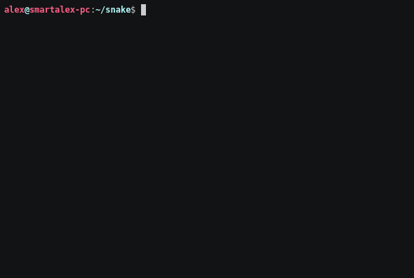

# snake.py

 [](https://codecov.io/gh/xvm32/snake.py)  

Classic snake game implementation written in Python using curses.



## Playing and development

You will need [poetry](https://github.com/python-poetry/poetry), preferably with these options in config:

```toml
virtualenvs.create = true
virtualenvs.in-project = true
```

Then clone the repo, cd into it, make a venv, activate it, and install the project:

```sh
git clone https://github.com/xvm32/pysnake
cd pysnake
poetry env use python3
. .venv/bin/activate
poetry install
```

To run tests, mypy checks, and style checks, you need to have Pythons:

- 3.6
- 3.7
- 3.8
- 3.9

For installing all the Python versions, I recommend [pyenv](https://github.com/pyenv/pyenv).

Once you have them, run:

```
tox
```

## Licensing

Licensed under the [MIT License](https://opensource.org/licenses/MIT). For details, see [LICENSE](https://github.com/xvm32/snake.py/blob/master/LICENSE)
